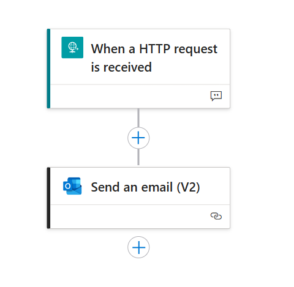
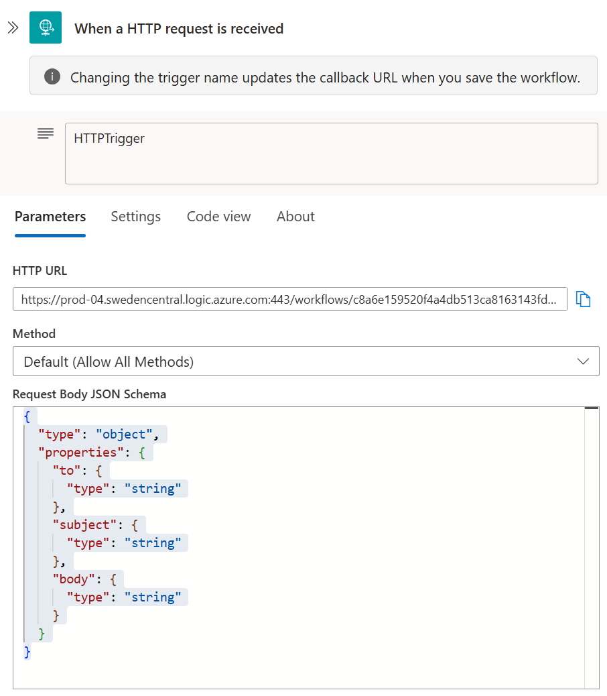
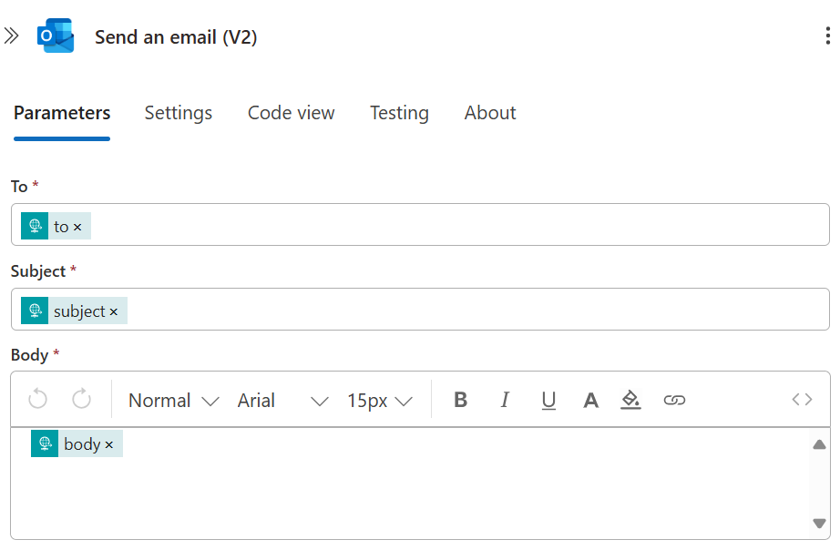
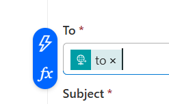

# 🛠️ Orchestrated Agents with Tools - External API Integration

Welcome to the advanced world of tool-enhanced agent orchestration! This folder contains comprehensive tutorials that show you how to integrate external APIs, services, and cloud workflows with Azure AI agents to create powerful, real-world applications.

## 📚 What's In This Folder

### 💱 [04.1 - OpenAPI Currency Exchange Tutorial](04.1-openapi_currency_exchange_tutorial.ipynb)
**Master external API integration using OpenAPI specifications**

Learn how to connect your agents to real-world services:
- 🎯 Understanding OpenAPI tools for external API integration
- 🌐 Connecting to Frankfurter currency exchange API
- 🔧 Azure AI Foundry SDK approach with OpenApiTool
- 🚀 Semantic Kernel approach with AzureAIAgent wrappers
- 💱 Real-time currency conversion and exchange rate queries
- 🔄 Comparative analysis of both integration approaches

**Perfect for**: Developers who want to connect their agents to external APIs and services for real-time data access and functionality.

### 🏦 [04.2 - Hybrid OpenAPI + Semantic Kernel Plugins Tutorial](04.2-hybrid_openapi_and_plugins_tutorial.ipynb)
**Combine external APIs with local plugins for comprehensive solutions**

Explore the power of hybrid architectures:
- 🔗 Combining OpenAPI tools with Semantic Kernel plugins
- 🏦 Banking scenario with local account data and external currency rates
- 📊 Local data processing with custom business logic
- 🌍 External API integration for real-time information
- 💰 Complex financial workflows requiring both approaches
- 🎯 Best practices for hybrid agent architectures

**Perfect for**: Developers building enterprise solutions that need both internal business logic and external service integration.

### 🔄 [04.3 - Logic Apps + Hybrid Tutorial](04.3-logic_apps_hybrid_tutorial.ipynb)
**Integrate Azure Logic Apps workflows with AI agent intelligence**

Master cloud workflow automation with AI coordination:
- ⚡ Azure Logic Apps integration for automated workflows
- 📧 Email notifications and business process automation
- 🔌 Semantic Kernel plugins for local data processing
- 🎭 Hybrid orchestration combining cloud automation with AI
- 📊 Business intelligence workflows with automated triggers
- 🔄 End-to-end scenarios from data analysis to notification

**Perfect for**: Developers who want to build intelligent automation systems that combine AI decision-making with enterprise workflow automation.

## 🎯 Learning Path

We recommend following the tutorials in this order:

1. **Start with 04.1** - Master external API integration fundamentals
2. **Progress to 04.2** - Learn hybrid architectures combining multiple tool types
3. **Complete with 04.3** - Integrate cloud workflows with AI orchestration

**Prerequisites**: Complete the [01-agent-basics](../01-agent-basics/), [02-agent-custom-functions](../02-agent-custom-functions/), and [03-orchestrated-agents](../03-orchestrated-agents/) tutorials first.

## 📋 Prerequisites

Before starting these tutorials, ensure you have:

### Previous Knowledge
- ✅ Completed all previous tutorial folders (01, 02, 03)
- ✅ Understanding of Azure AI Agents and custom functions
- ✅ Knowledge of agent orchestration patterns
- ✅ Familiarity with REST APIs and JSON

### Azure Resources
- ✅ Azure subscription with sufficient permissions
- ✅ Azure AI Foundry project
- ✅ Deployed AI model (GPT-4, GPT-3.5-turbo, etc.)
- ✅ Azure OpenAI resource (for Semantic Kernel scenarios)
- ✅ Azure Logic Apps (for workflow automation scenarios)

### Environment Setup
- ✅ Python 3.8+ installed
- ✅ Jupyter Notebook or VS Code with notebook support
- ✅ Azure CLI (recommended for authentication)
- ✅ Network access to external APIs (Frankfurter, etc.)


### Set up the Logic App on Azure

Please follow the [documentation](https://learn.microsoft.com/en-us/azure/ai-foundry/agents/how-to/tools/logic-apps?pivots=portal) link. The final Logic App should look like this:



When creating the trigger, please copy and paste the below in the "Request Body JSON Schema" field:

```json
{
  "type": "object",
  "properties": {
    "to": {
      "type": "string"
    },
    "subject": {
      "type": "string"
    },
    "body": {
      "type": "string"
    }
  }
}
```

The trigger step should look like this:




When creating the second step `Send an email (V2)`, please fill in the required fields as shown below:



The `to`, `subject`, and `body` fields will be available to populate from the previous step, which is the trigger. The `to` field will be used to send the email to the user, and the `subject` and `body` fields will be used to populate the email subject and body respectively. To add these fields, right-click on the "To*" field for example, then click on the blue lightning icon, and then select the proper value from the list of available fields. The final step should look like this:



Please note that the `Send an email (V2)` action in the Logic App requires a valid email address to send notifications, and the user has to **manually** go through authentication in the Azure Portal when adding this Step to the workflow. You can use your own email address or create a test email account for this purpose.

The final details in the Jupyter notebook will look like this (or similar):

```python 
# Logic App details
logic_app_name = "agent-logic-apps" # Resource name of the Logic App in Azure
trigger_name = "When_a_HTTP_request_is_received" # Trigger name for the Logic App
```


### Environment Variables
Configure your Azure AI services by filling in the `.env` file at the project root level:

```bash
# Navigate to the project root and edit the .env file
cd ../../  # Go to azure-ai-agents-playbook root
# Edit .env file with your Azure AI configuration
```

The `.env` file should contain your Azure AI project details:
```properties
# Required for all tutorials
PROJECT_ENDPOINT="https://your-foundry-resource.services.ai.azure.com/api/projects/your-project-name"
MODEL_DEPLOYMENT_NAME="your-model-deployment-name"

# Required for Semantic Kernel scenarios (04.1, 04.2)
AZURE_OPENAI_API_KEY="your-azure-openai-api-key"
AZURE_OPENAI_ENDPOINT="https://your-openai-resource.openai.azure.com/"
AZURE_OPENAI_CHAT_DEPLOYMENT_NAME="your-chat-deployment"
AZURE_OPENAI_DEPLOYMENT_NAME="your-deployment-name"
AZURE_OPENAI_API_VERSION="2024-12-01-preview"

# Required for Logic Apps integration (04.3)
AZURE_SUBSCRIPTION_ID="your-subscription-id"
AZURE_RESOURCE_GROUP_NAME="your-resource-group-name"

# Optional: For advanced scenarios
REASONING_MODEL_DEPLOYMENT_NAME="your-reasoning-model"
```

💡 **Tip**: The `.env` file is already present in the project root with example values. Simply update it with your Azure AI project details.

### Required Packages
Each tutorial will install its required packages, but you can install them all upfront:

```bash
pip install azure-ai-agents azure-identity semantic-kernel azure-mgmt-logic requests python-dotenv
```

## 🔑 Key Concepts Covered

### 🛠️ **External Tool Integration**

**What tool integration enables:**
- 🌐 **Real-time Data Access**: Live currency rates, weather, stock prices
- 🔗 **Service Integration**: Payment processing, communication, automation
- 📊 **Data Enrichment**: Combine internal data with external insights
- ⚡ **Workflow Automation**: Trigger business processes and notifications
- 🎯 **Dynamic Capabilities**: Extend agent functionality without code changes

### 🔧 **Tool Integration Approaches**

#### OpenAPI Tool Integration
- **Method**: `OpenApiTool` with standardized API specifications
- **Benefits**: Standardized integration, automatic parameter handling, documentation-driven
- **Use Cases**: Currency exchange, weather APIs, public data services
- **Example**: Frankfurter currency exchange API integration

#### Hybrid Plugin + API Architecture
- **Method**: Combine Semantic Kernel plugins with external APIs
- **Benefits**: Local + external data, secure business logic, flexible architectures
- **Use Cases**: Banking systems, enterprise applications, multi-source intelligence
- **Example**: Local banking data + external currency rates

#### Workflow Automation Integration
- **Method**: Azure Logic Apps integration with AI decision-making
- **Benefits**: Enterprise workflow automation, scalable process orchestration
- **Use Cases**: Business process automation, notification systems, approval workflows
- **Example**: Data analysis triggering automated email notifications

### 🏗️ **Advanced Architecture Patterns**

- **API Gateway Patterns**: Centralized external service management
- **Hybrid Data Processing**: Local business logic + external data sources
- **Workflow Orchestration**: AI-driven business process automation
- **Error Resilience**: Graceful handling of external service failures
- **Security Integration**: Secure API authentication and data handling

## 🏗️ What You'll Build

By the end of these tutorials, you'll have built:

### 🌐 **External API Integration Systems**
1. **Currency Exchange Agent** - Real-time currency conversion using external APIs
2. **Multi-API Coordination** - Agents that combine multiple external services
3. **Error-Resilient Integration** - Graceful handling of external service failures
4. **Authentication Patterns** - Secure API access and credential management

### 🏦 **Hybrid Business Applications**
1. **Banking Assistant** - Local account data + external exchange rates
2. **Financial Intelligence** - Multi-source data analysis and insights
3. **Investment Advisor** - Portfolio data + market APIs + news feeds
4. **Business Intelligence** - Internal metrics + external market data

### 🔄 **Workflow Automation Systems**
1. **Data Analysis Pipelines** - Automated processing and notification workflows
2. **Business Process Automation** - AI-driven decision making with workflow triggers
3. **Alert and Notification Systems** - Intelligent monitoring with automated responses
4. **Approval Workflows** - AI-assisted business process management

##  Additional Resources

- [Azure AI Agents OpenAPI Tools Documentation](https://docs.microsoft.com/azure/ai-services/agents/tools/openapi/)
- [Semantic Kernel External API Integration](https://learn.microsoft.com/semantic-kernel/plugins/external-apis/)
- [Azure Logic Apps Integration Guide](https://docs.microsoft.com/azure/logic-apps/)
- [OpenAPI Specification Documentation](https://swagger.io/specification/)
- [REST API Security Best Practices](https://docs.microsoft.com/azure/architecture/best-practices/api-security/)

## 🎯 Next Steps

After mastering orchestrated agents with external tools, explore:

- **[05-orchestrated-agents-with-custom-openapi-tools](../05-orchestrated-agents-with-custom-openapi-tools/)** - Building custom API integrations and advanced tool patterns
- **[06-magentic-one-orchestration](../06-magentic-one-orchestration/)** - Advanced multi-agent orchestration with sophisticated tool coordination
- **[07-voice-orchestration](../07-voice-orchestration/)** - Voice-enabled agent interactions and tool usage

---

🎉 **Ready to build sophisticated agent systems with external tool integration?** Start with basic OpenAPI integration and progress to complex hybrid architectures that combine the best of local intelligence and external services!
